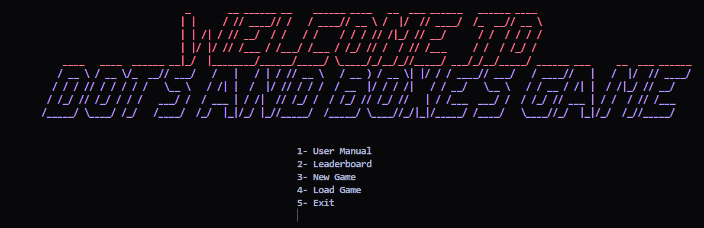
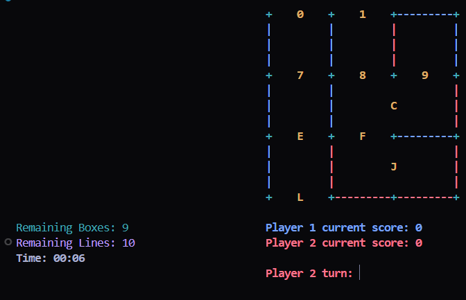
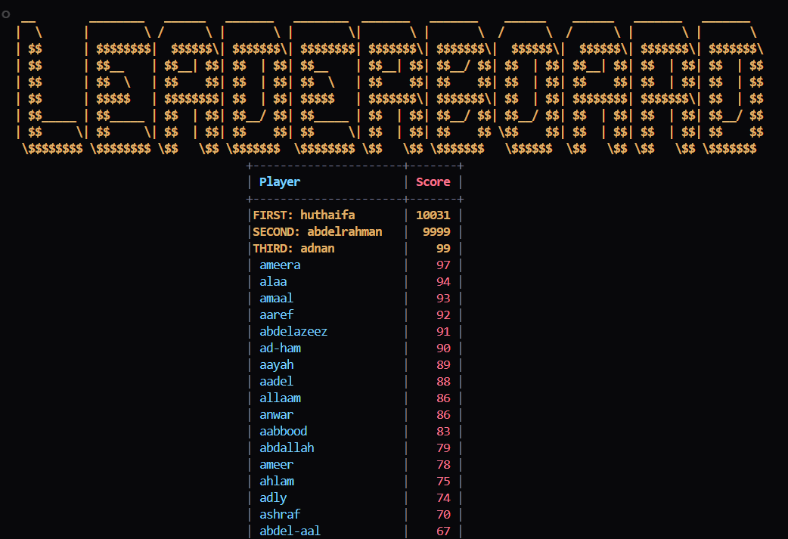

# 🎮 Dots and Boxes Game 🎮

🌟 A classic and engaging implementation of the Dots and Boxes game in **C**! Perfect for two players who love strategy games. Connect the dots, form boxes, and outsmart your opponent to capture the most boxes. Ready to play? Let’s dive in! 🚀

---

## 🖼️ **Game Preview**

### 📸 Screenshots

  
*Main Menu - Where the fun begins!*

  
*Gameplay - Strategize and conquer!*

  
*Leaderboard - Track your victories!*

### 🎥 Demo Videos


---

## ✨ **Features**

### 🎲 **Game Modes**
- **Player vs Player (PvP)**: Challenge a friend and see who’s the best!
- **Player vs Computer (PvC)**: Test your skills against an AI opponent.

### 🧩 **Board Size Options**
- Choose from **3x3** to **6x6** grids to customize your game experience.

### 🛠️ **Gameplay Features**
- **Undo/Redo System**: Made a mistake? No problem, undo your move!
- **Save/Load Game**: Save your progress with up to **3 save slots** and continue later.
- **Score Tracking & Leaderboard**: Keep track of your wins and climb the leaderboard.
- **Time Tracking**: See how fast you can complete the game.

### 🖥️ **User Interface**
- **Colored Text Interface**: A visually appealing and easy-to-navigate interface.
- **Grid-Based Game Board**: Clear and intuitive gameplay display.
- **Player Statistics**: Real-time stats to keep you informed.
- **Time Tracking**: Monitor your gameplay speed.

---

## 📜 **Game Rules**

1. **Take Turns**: Players alternate drawing lines between adjacent dots.
2. **Complete a Box**: When you complete the fourth side of a box:
   - **Score a point** 🎉
   - **Color the box** with your player color 🎨
   - **Get another turn** 🔄
3. **Game Ends**: When no more lines can be drawn.
4. **Winner**: The player with the most boxes wins! 🏆

---

## ⚙️ **Installation**

### 🛠️ **Step-by-Step Guide**

1. **Clone the Repository**:

   ```bash
   git clone https://github.com/your-repo/dots-and-boxes.git
   ```

2. **Compile the Source Code**:

    ```bash
    gcc -o dots_and_boxes main.c
    ```

3. **Run the Executable**:

   ```bash
    ./dots_and_boxes
    ```

---

## 💻 Technical Requirements

- **C Compiler** (GCC recommended)
- **Terminal** that **supports ANSI** color codes

---

## 🏫 About the Project

This project was developed as part of the **CS121: Computer Programming 1** course at **Alexandria University's Faculty of Engineering.** It’s a testament to the power of C programming and a fun way to learn and apply coding concepts.

---

## Happy Gaming! 🎮✨

Ready to challenge your friends or test your skills against the computer? Clone the repo, compile the code, and start playing today! 🎉
